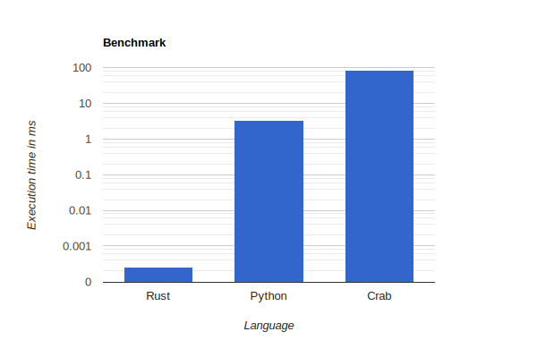

<p align="center">
  
</p>

# Crab
A tiny interpreted *crappy* toy language written in Rust.

## Iterative Fibonacci Algorithm

```
fn iterative_fib(n){
    if(n < 0){
        exit();
    }

    let a = 0;
    let b = 1;

    let loop_i = 0;
    while(loop_i < n){
        let temp = a;
        a += b;
        b = temp;
        loop_i += 1;
    }
    return a;
};

print(iterative_fib(10));
```

## Benchmark 

100000 iterations of computing iterative fibonacci functions for the 100th number. Needless to say this language is _not fast_ but what did you expect.

<p align="center">
  
</p>


